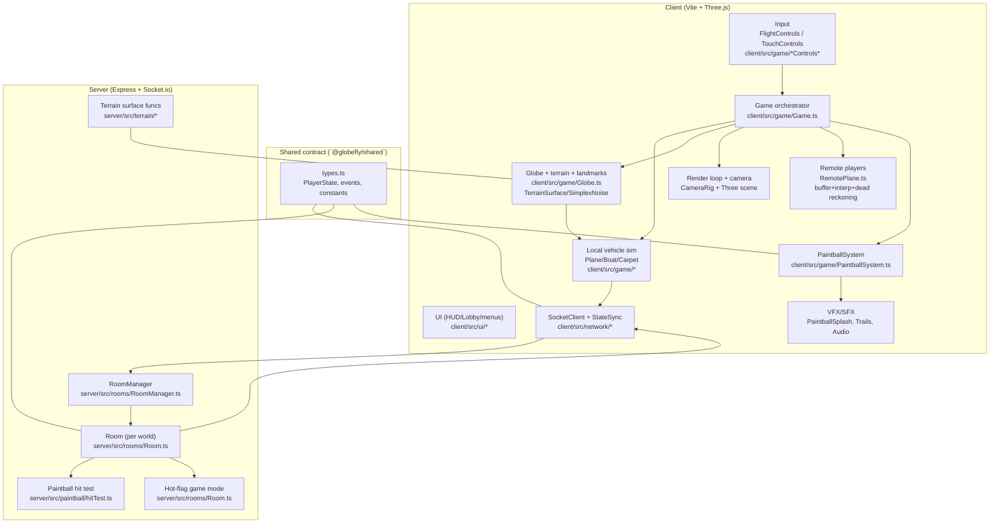
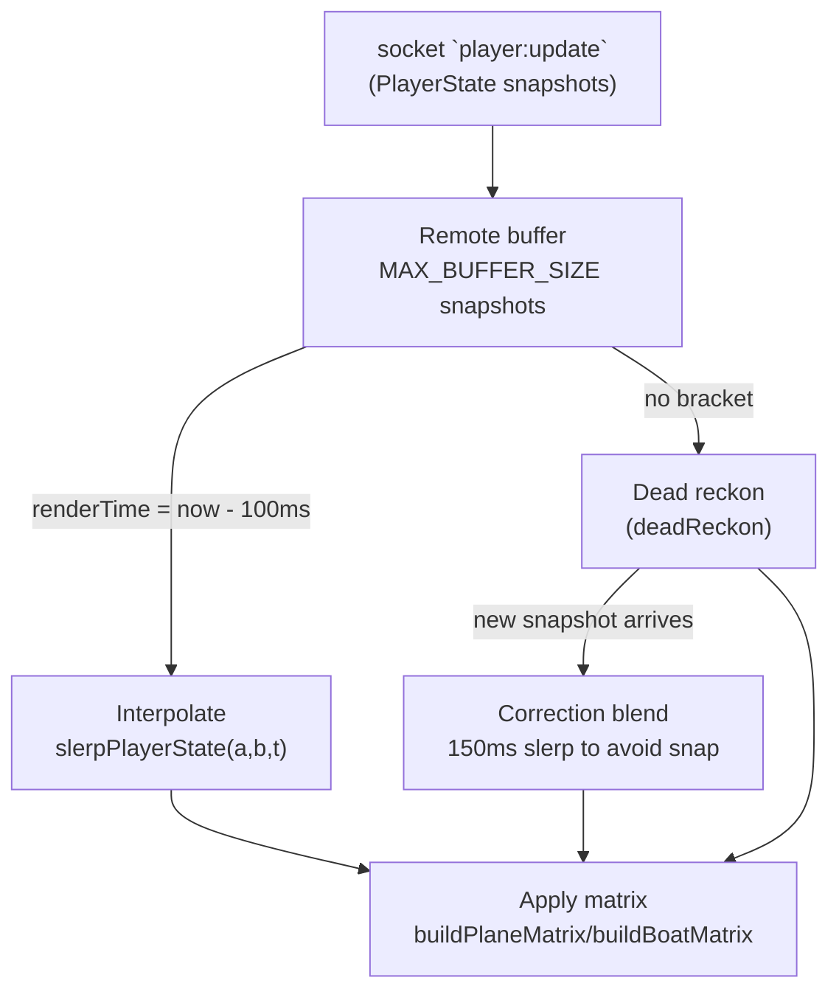

# `tinyskies` Context Knowledge Graph (GlobeFly)

Source repo: [`dannylimanseta/tinyskies`](https://github.com/dannylimanseta/tinyskies) (branch `cursor/globefly-multiplayer-globe-flight-game`).

This document is a **code-grounded knowledge graph** of the systems that make `tinyskies` (aka GlobeFly) feel **smooth**, **stable**, and **glitch-resistant**: spherical flight physics, rendering, networking, state interpolation, authoritative server events, and gameplay loops (paintballs, flag, world/terrain).

All file references below correspond to the vendored copy in this repo at `vendor/tinyskies/`.

---

## System map (high-level graph)

---

## Core “why it feels smooth” (design principles)

- **Continuous orientation on a sphere via quaternions** (not Euler for position): players move by *rotating a position quaternion along great-circle arcs*, eliminating pole singularities / gimbal-ish edge cases.
  - Client math lives in `client/src/game/SphericalMath.ts` (`moveOnSphere`, `tangentFrame`, `buildPlaneMatrix`).
  - Remote interpolation uses **slerp** on the same quaternion representation (`slerpPlayerState`), which is the correct interpolation for orientations/rotations on a sphere.

- **Remote smoothing pipeline = buffer → interpolate → dead-reckon fallback → correct softly**:
  - Remotes keep a small buffer of received snapshots (timestamped), render the world **100ms in the past**, and interpolate between two bracketing states.
  - If interpolation isn’t possible (packet delay/loss), they **dead-reckon** forward from the last snapshot.
  - When new data arrives after dead-reckoning, remotes **blend** from the last rendered state to the computed state over ~150ms to prevent visible snaps.
  - Implementation: `client/src/game/RemotePlane.ts` (constants `INTERPOLATION_DELAY_MS`, `CORRECTION_DURATION_MS`, `MAX_BUFFER_SIZE`, methods `tryInterpolate`, `doDeadReckon`, correction block in `update()`).

- **Local feel > network uncertainty**:
  - Local vehicle motion is simulated **client-side every frame**; networking is a periodic “state sync” that publishes the latest state at 20Hz.
  - `client/src/network/StateSync.ts` sends `player:move` every `SEND_RATE_MS = 50` (20Hz).
  - This decouples render/physics smoothness from network update rate.

- **Hard ceilings / clamping to prevent NaNs and runaway states**:
  - Example: local plane has `ABSOLUTE_MAX_SPEED` and clamps upgrade multipliers to stay within safe bounds.
  - Plane update loop: `client/src/game/Plane.ts` (notably: “Hard speed ceiling — prevents physics/NaN issues from stacked upgrades.”).

---

## Data model (the “truth” that crosses the wire)

### `PlayerState` is a compact spherical pose + gameplay flags

Defined in `shared/types.ts`:

- **Pose**
  - `qx,qy,qz,qw`: quaternion representing **position on the globe surface** (orientation of “up” / surface normal).
  - `heading`: yaw in the local tangent frame.
  - `pitch`: pitch relative to tangent forward.
  - `altitude`: height above globe surface radius.
  - `speed`, `bankAngle`, `rollAngle`: extra state for visuals + motion.
- **Identity & metadata**
  - `id`, `name`, optional `vehicle`, `vehicleColor`
- **Gameplay**
  - `carrying` (package quest / etc)
  - `visibility` (fade controls for cinematics like moon scenes)
  - Carpet-only: `carpetPortals`, `carpetPortalTeleportSeq` (special case to avoid interpolating teleports)
- **Time**
  - `timestamp`: used by remote interpolation.

This is *intentionally small* so it can be sent frequently and buffered.

---

## Physics & movement (spherical flight model)

### The key representation: **position as quaternion**

The player’s “where on the globe” is **not a Cartesian position**; it’s `qPosition`, a quaternion that maps a reference up vector to the local surface normal.

- `tangentFrame(qPosition)` produces:
  - `up`: radial normal
  - `north`, `east`: tangent basis directions
  - File: `client/src/game/SphericalMath.ts`

### Advancing along the globe: great-circle arc step

Local movement advances by rotating the position quaternion around an axis derived from desired tangent direction:

- `moveOnSphere(qPosition, heading, arcAngle)`:
  - Compute `dir` on tangent plane from `north/east` + `heading`
  - Rotation axis is `dir x up`
  - Apply quaternion rotation by `arcAngle` (distance / globeRadius)
  - File: `client/src/game/SphericalMath.ts`

### Rendering transform is composed consistently

The visible mesh transform is built from the same primitives:

- `buildPlaneMatrix(qPosition, heading, pitch, bankAngle, altitude, globeRadius)` composes:
  - Tangent basis (north/east/up) from `qPosition`
  - Forward from heading, then pitch around right axis, then bank around forward axis
  - World position from `cartesianFromSpherical(qPosition, altitude, globeRadius)`
  - File: `client/src/game/SphericalMath.ts`

This matters because multiple systems must agree on this exact mapping:

- Client render transforms
- Client muzzle ray for paintballs
- Server hit-test “forward” ray for paintballs

You can see this intent explicitly in `SphericalMath.ts`: `paintballRayFromPlaneState(...)` includes a note to “stay aligned with server `paintball/hitTest`”.

### Local plane “physics” is gameplay-tuned but numerically stable

The plane is not a rigid-body sim; it’s an **arc-step controller** with:

- **Speed model**: accelerate, brake decel, min/max speed, temporary boost speed.
- **Input smoothing**:
  - Smoothed yaw (`TURN_INPUT_SMOOTH`) to reduce jitter while staying responsive.
  - Smoothed climb blend (`ELEVATE_INPUT_SMOOTH`) so altitude changes ramp instead of snapping.
- **Altitude model**: target altitude lerps with a rate, then clamps to a **hard floor above terrain**.
- **Great-circle step**: arc angle computed as \(\text{arcAngle} = \frac{\text{speed}\cdot dt}{\text{globeRadius}}\) and applied via `moveOnSphere`.
- **Bank model**: bank follows smoothed yaw with responsiveness, and is clamped to `MAX_BANK`.
- **Safety clamps**:
  - `ABSOLUTE_MAX_SPEED` hard cap (prevents bad states from stacked multipliers/upgrades).

Implementation: `client/src/game/Plane.ts` (`Plane.update()`).

### Terrain-aware clearance prevents “ground glitches”

Plane altitude is prevented from dipping into terrain by sampling surface height at the current surface normal:

- Client: `surfaceAltitudeAt(seed, terrainType, up.x, up.y, up.z)` and then:
  - `hardFloor = surfaceAlt + LOW_HOVER_HEIGHT`
  - `altitude = max(altitude, hardFloor)`
  - File: `client/src/game/Plane.ts`

This avoids clipping into mountains/ocean while still letting the player “descend” visually.

---

## Networking (smooth state, minimal authority)

### What the client sends (20Hz)

`StateSync` publishes the latest local state at 20Hz:

- File: `client/src/network/StateSync.ts`
- Event: `player:move` via `SocketClient.sendMove(...)`
- Rate: `SEND_RATE_MS = 50`
- Important normalization choices:
  - Boats zero out pitch and bank for net state (boats do their bobbing locally for visuals).
  - For planes, `bankAngle` sent is `bankAngle + rollAngle` (the local sim keeps these separate).
  - Includes optional `visibility` and carpet portal snapshots.

### What the server does (relay + authoritative minigames)

The server is a **relay** for movement state (it stores and re-broadcasts what clients send), and becomes authoritative for:

- **Paintball firing constraints & hit selection**
- **Hot-flag mode** (spawn/pickup/challenge/steal timers and immunity windows)

Key files:

- Join/room orchestration: `server/src/rooms/RoomManager.ts`
  - attaches socket listeners for `player:move`, `paintball:fire`, etc.
- Per-world logic: `server/src/rooms/Room.ts`
  - stores `PlayerState` by socket id
  - broadcasts `player:joined`, `player:left`, `player:update`

### Remote players on the client: interpolation graph

Implementation: `client/src/game/RemotePlane.ts`

### Special case: teleports must not be interpolated

Carpet portals can cause discontinuous motion. Remote smoothing resets its buffer when it detects a teleport sequence change:

- State field: `carpetPortalTeleportSeq` (`shared/types.ts`)
- Handling: `RemotePlane.pushState()` clears buffer + fades opacity to avoid snapping artifacts.
  - File: `client/src/game/RemotePlane.ts`

---

## Gameplay: paintballs (client UX + server authority)

Paintballs are a good example of how the game stays responsive without desync.

### 1) Client input → immediate feedback (optimistic projectile)

- Player presses Space → `FlightControls` queues a one-shot `paintball=true` (consumed once per frame).
  - File: `client/src/game/FlightControls.ts`
- Game loop sees `paintball` and calls `PaintballSystem.tryLocalFire(plane)`.
  - Files: `client/src/game/Game.ts` (wiring) + `client/src/game/PaintballSystem.ts` (logic)
- If connected, it emits `paintball:fire` to server, **but still spawns a local projectile immediately**:
  - `PaintballSystem.fireOnce()` contains an explicit “optimistic spawn” note to handle slow/lost server echoes.

### 2) Server validates fire rate + selects hit target

- Gatekeeping lives in `Room.firePaintball(socketId)`:
  - Enforces cooldown or “double tap burst” window.
  - Rejects non-plane vehicles.
  - Uses stored per-socket upgrade flags but clamps them (anti-cheat bounds).
  - File: `server/src/rooms/Room.ts`

- Hit-test lives in `server/src/paintball/hitTest.ts`:
  - Computes a ray from shooter muzzle along **pitched forward** direction (must match client’s math).
  - Picks nearest victim whose distance to ray segment is within `PAINTBALL_HIT_RADIUS`.
  - Broadcasts:
    - `paintball:fired` (shot origin/direction/speed/color)
    - `paintball:hit` (victim id + deterministic splat seed)

### 3) Client receives authoritative events → visuals reconcile

`PaintballSystem` listens for:

- `paintball:fired`: spawns projectile for **other players** (local already spawned optimistically).
- `paintball:hit`: removes the projectile for that shooter (if present), then:
  - applies splatter decals to the victim’s mesh using `DecalGeometry` + `Raycaster`
  - plays splash VFX
  - triggers a small “hit wobble” for the victim (local or remote)

Files:

- `client/src/game/PaintballSystem.ts`
- `client/src/game/RemotePlane.ts` (remote wobble hook)
- `client/src/game/Plane.ts` (local wobble)

### Consistency contract: client & server compute the same forward ray

There are **two parallel implementations** of “plane forward ray”:

- Client: `paintballRayFromPlaneState(...)` in `client/src/game/SphericalMath.ts`
- Server: `planeForward(...)` in `server/src/paintball/hitTest.ts`

This is deliberate: server authority depends on using the same meaning of `heading` + `pitch` on a spherical tangent frame.

---

## Gameplay: “hot potato” flag (server-authoritative)

The hot-flag mode is entirely coordinated by the server `Room`:

- Modes:
  - `inactive` (not enough players)
  - `free` (flag is floating at world position)
  - `held` (a player is the holder)
- Core behaviors:
  - Spawn after delay when \(\ge 2\) players are present
  - Free pickup within `FLAG_COLLECT_RADIUS`
  - Challenges: staying within `FLAG_CAPTURE_RADIUS` for `FLAG_CAPTURE_DURATION_MS`
  - Immunity after steals `FLAG_IMMUNITY_MS`
  - Grace window for briefly out-of-range `FLAG_CAPTURE_GRACE_MS`

Implementation details:

- File: `server/src/rooms/Room.ts`
- Shared constants + events: `shared/types.ts` (`FLAG_*`, `Flag*Event`)
- The server emits events like:
  - `flag:spawned`, `flag:collected`, `flag:capture_start`, `flag:capture_end`, `flag:stolen`, `flag:dropped`, `flag:sync`

Client-side visuals/UI are driven by these events (see `client/src/game/FlagSystem.ts` wiring in `Game.ts`).

---

## World & terrain (procedural globe that still performs)

### Terrain sampling: deterministic + shared intent

The world is seeded:

- `Globe` is constructed with `(radius, seed, terrainType, ...)`
  - File: `client/src/game/Globe.ts`
- Surface displacement and altitude functions are centralized:
  - Client: `client/src/game/TerrainSurface.ts` (and `SimplexNoise.ts`)
  - Server mirrors “surface displacement” for flag spawn altitude:
    - `server/src/terrain/TerrainSurface.ts`
    - used in `Room.spawnHotFlagAtRandomPosition()` so the flag floats above terrain, not inside it.

### Performance: heavy decoration via InstancedMesh + procedural materials

`Globe.ts` builds a lot of world detail, but avoids “draw-call death” by:

- Using **`InstancedMesh`** for repeated props/particles (trees, steam, sparkles, etc.)
- Using `onBeforeCompile` to extend materials/shaders without custom full shader pipelines
- Caching uniforms/arrays that update each frame (e.g., `oceanTime`, `treeSwayUniforms`)

Examples visible in `Globe.ts`:

- Surface mesh is a displaced sphere with per-vertex colors and an `oceanDepth` attribute to shade foam/coastlines.
- Ocean animation is driven by a uniform `oceanTime` updated during `Globe.update(dt)`.

### “No glitches” strategy for terrain + flight

This combination is what prevents common globe-game artifacts:

- **No singularities at the poles**: tangent frame derived from quaternion orientation.
- **Stable clearance**: altitude clamps use sampled surface altitude on the current normal.
- **Consistent shared surface model**: server uses terrain displacement for authoritative spawns (flag).

---

## Game loop orchestration (where systems connect)

`client/src/game/Game.ts` is the main integration point. Key responsibilities:

- Create Three.js scene/camera/lights and keep them sized to the container.
- Create the `Globe` (seed + terrain) and the local player vehicle.
- Initialize networking:
  - `SocketClient` handlers for join/leave/update/state and for paintball/flag events
  - Start `StateSync` at 20Hz
- Per-frame step:
  - Read controls
  - Update local vehicle (`Plane.update(...)` etc.)
  - Update `RemotePlaneManager` (interp/dead-reckon/correction)
  - Update gameplay systems (paintballs, quests, VFX, audio, etc.)

You can locate the wiring quickly in `Game.ts` by searching for:

- `new SocketClient(...)`
- `new StateSync(...)`
- `new PaintballSystem(...)`
- `this.localPlayer.update(...)`
- `this.remotePlanes.update(...)`

---

## “If you want to replicate this feel” (checklist)

- **Represent surface position as a quaternion** (or an equivalent robust manifold representation), and move by rotating along arcs.
- **Use a small interpolation delay** for remote state (e.g. 100ms) and slerp the quaternion position.
- **Dead-reckon** when you lack bracketing snapshots, but **blend back** when packets resume.
- **Decouple render/physics rate from network send rate** (e.g. local sim every frame, sync at 20Hz).
- **Clamp everything** that can explode: speeds, multipliers, time steps (dt max), array sizes, and incoming client-provided upgrade values on the server.
- **Ensure client/server math agree** for any server-authoritative action (paintball rays, terrain-based spawns).

---

## Primary code index (files you’ll keep coming back to)

### Client

- **Game orchestration**: `vendor/tinyskies/client/src/game/Game.ts`
- **Spherical math + interpolation**: `vendor/tinyskies/client/src/game/SphericalMath.ts`
- **Local plane movement**: `vendor/tinyskies/client/src/game/Plane.ts`
- **Remote smoothing**: `vendor/tinyskies/client/src/game/RemotePlane.ts`
- **Networking**: `vendor/tinyskies/client/src/network/SocketClient.ts`, `vendor/tinyskies/client/src/network/StateSync.ts`
- **Paintballs**: `vendor/tinyskies/client/src/game/PaintballSystem.ts`
- **Procedural world**: `vendor/tinyskies/client/src/game/Globe.ts`, `vendor/tinyskies/client/src/game/TerrainSurface.ts`, `vendor/tinyskies/client/src/game/SimplexNoise.ts`

### Shared

- **Types + gameplay constants**: `vendor/tinyskies/shared/types.ts`

### Server

- **Rooms + socket handlers**: `vendor/tinyskies/server/src/rooms/RoomManager.ts`, `vendor/tinyskies/server/src/rooms/Room.ts`
- **Paintball hit test**: `vendor/tinyskies/server/src/paintball/hitTest.ts`
- **Terrain (server mirror)**: `vendor/tinyskies/server/src/terrain/TerrainSurface.ts`

